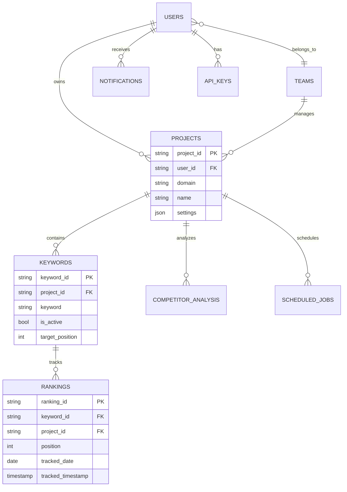

# Database Design

## Overview

Rankup uses a hybrid database approach optimized for scale and performance:

### Data Storage Strategy

| Data Type | Storage | Volume | Purpose |
|-----------|---------|--------|---------|
| Analytics Data | BigQuery | 10M+ records | Historical rankings, search data |
| Metadata | Convex | <100MB | Real-time operations, settings |
| Cache | Redis | Temporary | Performance optimization |

### Why This Architecture?

1. **Cost Optimization**: BigQuery for analytics at $5/TB vs $0.20/GB in traditional DBs
2. **Performance**: Real-time updates via Convex, analytics via BigQuery
3. **Scalability**: Each component scales independently
4. **Simplicity**: Clear boundaries, no data duplication

## 2. BigQuery Schema Design

### 2.1 Core Tables

#### rankings
```sql
CREATE TABLE `rankup.seo_rankings.rankings` (
  -- Identifiers
  ranking_id STRING NOT NULL,          -- UUID
  keyword_id STRING NOT NULL,          -- Reference to keywords
  project_id STRING NOT NULL,          -- Reference to projects
  
  -- Ranking Data
  position INT64,                      -- 1-100, NULL if not found
  url STRING,                          -- Ranking URL
  title STRING,                        -- Page title
  snippet STRING,                      -- Meta description
  
  -- Tracking Metadata
  tracked_date DATE NOT NULL,          -- For partitioning
  tracked_timestamp TIMESTAMP NOT NULL, -- Exact time
  
  -- SEO Metrics
  search_volume INT64,                 -- Monthly searches
  keyword_difficulty FLOAT64,          -- 0-100
  cpc FLOAT64,                        -- Cost per click
  competition FLOAT64,                 -- 0-1
  
  -- Search Parameters
  search_engine STRING NOT NULL,       -- google, bing, yahoo
  device STRING NOT NULL,              -- desktop, mobile, tablet
  location_code STRING,                -- us, vn, etc.
  language_code STRING,                -- en, vi, etc.
  
  -- SERP Features
  featured_snippet BOOL,
  knowledge_panel BOOL,
  site_links BOOL,
  people_also_ask BOOL,
  local_pack BOOL,
  image_pack BOOL,
  video_carousel BOOL,
  
  -- Competitor Data
  competitor_urls ARRAY<STRUCT<
    domain STRING,
    position INT64,
    url STRING
  >>,
  
  -- Metadata
  created_at TIMESTAMP DEFAULT CURRENT_TIMESTAMP()
)
PARTITION BY tracked_date
CLUSTER BY project_id, keyword_id
OPTIONS(
  description="Historical ranking data",
  partition_expiration_days=730  -- 2 years retention
);
```

#### keywords
```sql
CREATE TABLE `rankup.seo_rankings.keywords` (
  keyword_id STRING NOT NULL,
  project_id STRING NOT NULL,
  
  -- Keyword Data
  keyword STRING NOT NULL,
  keyword_type STRING,                 -- primary, secondary, long-tail
  
  -- Configuration
  is_active BOOL DEFAULT true,
  tracking_frequency STRING DEFAULT 'daily', -- daily, weekly, monthly
  tracking_engines ARRAY<STRING>,      -- ['google', 'bing']
  tracking_devices ARRAY<STRING>,      -- ['desktop', 'mobile']
  tracking_locations ARRAY<STRING>,    -- ['us', 'vn']
  
  -- Grouping & Organization
  tags ARRAY<STRING>,
  category STRING,
  priority STRING,                     -- high, medium, low
  group_id STRING,                     -- For keyword groups
  
  -- Target Metrics
  target_position INT64,
  target_url STRING,
  current_position INT64,              -- Denormalized for performance
  best_position INT64,
  
  -- SEO Data (cached)
  search_volume INT64,
  trend_data ARRAY<STRUCT<
    month STRING,
    volume INT64
  >>,
  
  -- Metadata
  created_at TIMESTAMP DEFAULT CURRENT_TIMESTAMP(),
  updated_at TIMESTAMP DEFAULT CURRENT_TIMESTAMP(),
  created_by STRING,                   -- User ID
  
  -- Analytics
  total_searches INT64 DEFAULT 0,
  last_checked TIMESTAMP,
  check_count INT64 DEFAULT 0
);
```

#### projects
```sql
CREATE TABLE `rankup.seo_rankings.projects` (
  project_id STRING NOT NULL,
  user_id STRING NOT NULL,             -- Clerk user ID
  team_id STRING,
  
  -- Project Info
  name STRING NOT NULL,
  domain STRING NOT NULL,
  domain_verified BOOL DEFAULT false,
  
  -- Configuration
  settings STRUCT<
    tracking_enabled BOOL,
    tracking_frequency STRING,
    notification_settings STRUCT<
      email_alerts BOOL,
      sms_alerts BOOL,
      webhook_url STRING,
      alert_rules ARRAY<STRUCT<
        type STRING,                   -- position_drop, new_ranking, etc
        threshold INT64,
        enabled BOOL
      >>
    >,
    competitor_domains ARRAY<STRING>,
    blocked_keywords ARRAY<STRING>
  >,
  
  -- Quotas & Limits
  keyword_limit INT64 DEFAULT 1000,
  keywords_used INT64 DEFAULT 0,
  api_calls_limit INT64 DEFAULT 10000,
  api_calls_used INT64 DEFAULT 0,
  
  -- Billing
  subscription_tier STRING,            -- starter, pro, enterprise
  subscription_status STRING,          -- active, cancelled, past_due
  billing_cycle STRING,                -- monthly, yearly
  
  -- Metadata
  created_at TIMESTAMP DEFAULT CURRENT_TIMESTAMP(),
  updated_at TIMESTAMP DEFAULT CURRENT_TIMESTAMP(),
  last_crawled TIMESTAMP
);
```

### 2.2 Analytics Tables

#### ranking_changes
```sql
CREATE TABLE `rankup.seo_rankings.ranking_changes` (
  change_id STRING NOT NULL,
  keyword_id STRING NOT NULL,
  project_id STRING NOT NULL,
  
  -- Change Data
  date DATE NOT NULL,
  previous_position INT64,
  current_position INT64,
  position_change INT64,               -- current - previous
  
  -- Change Classification
  change_type STRING,                  -- improved, declined, new, lost
  change_magnitude STRING,             -- small (1-3), medium (4-10), large (>10)
  
  -- URL Changes
  previous_url STRING,
  current_url STRING,
  url_changed BOOL,
  
  -- Context
  search_engine STRING,
  device STRING,
  location_code STRING
)
PARTITION BY date
CLUSTER BY project_id, keyword_id;
```

#### competitor_analysis
```sql
CREATE TABLE `rankup.seo_rankings.competitor_analysis` (
  analysis_id STRING NOT NULL,
  project_id STRING NOT NULL,
  competitor_domain STRING NOT NULL,
  analysis_date DATE NOT NULL,
  
  -- Metrics
  visibility_score FLOAT64,            -- Custom visibility metric
  keywords_total INT64,
  keywords_top3 INT64,
  keywords_top10 INT64,
  keywords_top100 INT64,
  
  -- Share of Voice
  sov_percentage FLOAT64,
  sov_change FLOAT64,
  
  -- Keyword Overlap
  common_keywords ARRAY<STRING>,
  unique_keywords ARRAY<STRING>,
  
  -- Performance
  avg_position FLOAT64,
  total_traffic_estimate INT64,
  
  created_at TIMESTAMP DEFAULT CURRENT_TIMESTAMP()
)
PARTITION BY analysis_date;
```

### 2.3 Materialized Views

#### latest_rankings_mv
```sql
CREATE MATERIALIZED VIEW `rankup.seo_rankings.latest_rankings_mv`
PARTITION BY project_id
CLUSTER BY keyword_id
AS
WITH ranked_data AS (
  SELECT 
    *,
    ROW_NUMBER() OVER (
      PARTITION BY keyword_id, search_engine, device, location_code 
      ORDER BY tracked_timestamp DESC
    ) as rn
  FROM `rankup.seo_rankings.rankings`
  WHERE tracked_date >= DATE_SUB(CURRENT_DATE(), INTERVAL 7 DAY)
)
SELECT * FROM ranked_data WHERE rn = 1;
```

#### keyword_performance_mv
```sql
CREATE MATERIALIZED VIEW `rankup.seo_rankings.keyword_performance_mv`
AS
SELECT 
  keyword_id,
  project_id,
  
  -- Current Metrics
  ANY_VALUE(position ORDER BY tracked_timestamp DESC LIMIT 1) as current_position,
  ANY_VALUE(url ORDER BY tracked_timestamp DESC LIMIT 1) as current_url,
  
  -- Historical Metrics
  MIN(position) as best_position,
  AVG(position) as avg_position,
  STDDEV(position) as position_volatility,
  
  -- Trends
  ANY_VALUE(position ORDER BY tracked_timestamp DESC LIMIT 1) - 
    ANY_VALUE(position ORDER BY tracked_timestamp ASC LIMIT 1) as total_change,
  
  -- Counts
  COUNT(*) as data_points,
  COUNT(DISTINCT url) as url_variations,
  
  MIN(tracked_timestamp) as first_seen,
  MAX(tracked_timestamp) as last_seen
  
FROM `rankup.seo_rankings.rankings`
WHERE tracked_date >= DATE_SUB(CURRENT_DATE(), INTERVAL 90 DAY)
GROUP BY keyword_id, project_id;
```

## 3. Convex Schema Design

### 3.1 Schema Definition

```typescript
// convex/schema.ts
import { defineSchema, defineTable } from "convex/server";
import { v } from "convex/values";

export default defineSchema({
  // User Management
  users: defineTable({
    clerkId: v.string(),
    email: v.string(),
    name: v.string(),
    role: v.string(), // admin, user, viewer
    teamId: v.optional(v.id("teams")),
    settings: v.object({
      timezone: v.string(),
      emailNotifications: v.boolean(),
      smsNotifications: v.optional(v.boolean()),
      language: v.string(),
    }),
    subscription: v.object({
      tier: v.string(),
      status: v.string(),
      validUntil: v.optional(v.number()),
    }),
    createdAt: v.number(),
    lastLogin: v.number(),
  })
    .index("by_clerk", ["clerkId"])
    .index("by_team", ["teamId"]),

  // Team Management
  teams: defineTable({
    name: v.string(),
    ownerId: v.id("users"),
    members: v.array(v.id("users")),
    settings: v.object({
      defaultTimezone: v.string(),
      brandingColor: v.optional(v.string()),
    }),
    subscription: v.object({
      tier: v.string(),
      seats: v.number(),
      validUntil: v.number(),
    }),
    createdAt: v.number(),
  }),

  // Project Metadata (chỉ lưu metadata, data thực ở BigQuery)
  projects: defineTable({
    projectId: v.string(), // Reference to BigQuery project_id
    userId: v.string(), // Clerk user ID
    teamId: v.optional(v.id("teams")),
    name: v.string(),
    domain: v.string(),
    isActive: v.boolean(),
    settings: v.object({
      trackingEnabled: v.boolean(),
      defaultFrequency: v.string(),
      notificationEmail: v.optional(v.string()),
    }),
    // Cached stats từ BigQuery (update định kỳ)
    cachedStats: v.optional(v.object({
      totalKeywords: v.number(),
      activeKeywords: v.number(),
      avgPosition: v.number(),
      lastUpdated: v.number(),
    })),
    createdAt: v.number(),
    updatedAt: v.number(),
  })
    .index("by_team", ["teamId"])
    .index("by_domain", ["domain"]),

  // Notifications & Alerts
  notifications: defineTable({
    userId: v.id("users"),
    projectId: v.optional(v.string()),
    type: v.string(), // ranking_change, competitor_alert, system
    severity: v.string(), // info, warning, error, critical
    title: v.string(),
    message: v.string(),
    data: v.optional(v.any()),
    isRead: v.boolean(),
    isArchived: v.boolean(),
    createdAt: v.number(),
    expiresAt: v.optional(v.number()),
  })
    .index("by_user", ["userId"])
    .index("by_user_unread", ["userId", "isRead"])
    .index("by_created", ["createdAt"]),

  // Real-time Ranking Updates
  rankingUpdates: defineTable({
    projectId: v.string(),
    keywordId: v.string(),
    updateType: v.string(), // position_change, new_ranking, lost_ranking
    data: v.object({
      previousPosition: v.optional(v.number()),
      currentPosition: v.optional(v.number()),
      change: v.optional(v.number()),
      url: v.optional(v.string()),
      searchEngine: v.string(),
      device: v.string(),
    }),
    timestamp: v.number(),
  })
    .index("by_project", ["projectId"])
    .index("by_timestamp", ["timestamp"]),

  // API Keys & Access
  apiKeys: defineTable({
    userId: v.id("users"),
    name: v.string(),
    key: v.string(),
    permissions: v.array(v.string()),
    rateLimit: v.object({
      requests: v.number(),
      period: v.string(), // hour, day, month
    }),
    usage: v.object({
      requests: v.number(),
      lastUsed: v.optional(v.number()),
    }),
    isActive: v.boolean(),
    expiresAt: v.optional(v.number()),
    createdAt: v.number(),
  })
    .index("by_user", ["userId"])
    .index("by_key", ["key"]),

  // Scheduled Jobs
  scheduledJobs: defineTable({
    projectId: v.string(),
    jobType: v.string(), // ranking_check, report_generation
    schedule: v.string(), // cron expression
    config: v.any(),
    lastRun: v.optional(v.number()),
    nextRun: v.number(),
    status: v.string(), // active, paused, failed
    isActive: v.boolean(),
  })
    .index("by_project", ["projectId"])
    .index("by_next_run", ["nextRun"]),

  // Activity Logs
  activityLogs: defineTable({
    userId: v.id("users"),
    action: v.string(),
    resource: v.string(),
    resourceId: v.optional(v.string()),
    details: v.optional(v.any()),
    ipAddress: v.optional(v.string()),
    userAgent: v.optional(v.string()),
    timestamp: v.number(),
  })
    .index("by_user", ["userId"])
    .index("by_timestamp", ["timestamp"]),
});
```

## 4. Redis Cache Schema

### 4.1 Cache Keys Structure

```typescript
// Cache key patterns
const cacheKeys = {
  // User sessions
  session: (userId: string) => `session:${userId}`,
  
  // Project stats
  projectStats: (projectId: string) => `stats:project:${projectId}`,
  
  // Latest rankings
  latestRankings: (projectId: string, page: number) => 
    `rankings:latest:${projectId}:${page}`,
  
  // Analytics data
  analytics: (projectId: string, metric: string, period: string) => 
    `analytics:${projectId}:${metric}:${period}`,
  
  // API rate limiting
  rateLimit: (apiKey: string, window: string) => 
    `rate:${apiKey}:${window}`,
  
  // Query results
  queryResult: (queryHash: string) => `query:${queryHash}`,
};

// TTL configurations (in seconds)
const ttlConfig = {
  session: 3600,              // 1 hour
  projectStats: 300,          // 5 minutes
  latestRankings: 600,        // 10 minutes
  analytics: 1800,            // 30 minutes
  rateLimit: 3600,           // 1 hour
  queryResult: 3600,         // 1 hour
};
```

### 4.2 Cache Strategies

```typescript
// Example cache implementation
class CacheService {
  async getOrSet<T>(
    key: string,
    fetcher: () => Promise<T>,
    ttl: number
  ): Promise<T> {
    // Check cache
    const cached = await redis.get(key);
    if (cached) {
      return JSON.parse(cached);
    }
    
    // Fetch from source
    const data = await fetcher();
    
    // Set in cache
    await redis.setex(key, ttl, JSON.stringify(data));
    
    return data;
  }
  
  async invalidate(pattern: string): Promise<void> {
    const keys = await redis.keys(pattern);
    if (keys.length > 0) {
      await redis.del(...keys);
    }
  }
}
```

## 5. Data Relationships



## 6. Indexing Strategy

### 6.1 BigQuery Indexes (via Clustering)
- Rankings: `(project_id, keyword_id, tracked_date)`
- Keywords: `(project_id, is_active, priority)`
- Competitor Analysis: `(project_id, competitor_domain)`

### 6.2 Convex Indexes
- Users: `by_clerk`, `by_team`
- Projects: `by_team`, `by_domain`
- Notifications: `by_user`, `by_user_unread`
- Activity Logs: `by_user`, `by_timestamp`

## 7. Data Retention Policies

### 7.1 BigQuery
- **Rankings**: 2 years (configurable per tier)
- **Aggregated data**: Indefinite
- **Raw SERP data**: 90 days

### 7.2 Convex
- **Notifications**: 30 days
- **Activity logs**: 90 days
- **Real-time updates**: 7 days

### 7.3 Redis
- **Session data**: 1 hour
- **Cache data**: 5-60 minutes
- **Rate limit**: Rolling window

## 8. Performance Optimizations

### 8.1 Query Optimization
```sql
-- Use materialized views for common queries
SELECT * FROM latest_rankings_mv 
WHERE project_id = @project_id 
LIMIT 100;

-- Partition pruning
SELECT * FROM rankings
WHERE tracked_date = CURRENT_DATE()
  AND project_id = @project_id;
```

### 8.2 Batch Operations
```typescript
// Batch insert rankings
async function batchInsertRankings(rankings: RankingData[]) {
  const chunks = chunk(rankings, 1000);
  
  await Promise.all(
    chunks.map(chunk => 
      bigquery.table('rankings').insert(chunk)
    )
  );
}
```

## 9. Migration Strategy

### 9.1 Initial Setup
```bash
# Create BigQuery dataset
bq mk --dataset --location=US rankup:seo_rankings

# Apply schema
bq mk --table rankup:seo_rankings.rankings schema/rankings.json
bq mk --table rankup:seo_rankings.keywords schema/keywords.json

# Create materialized views
bq query --use_legacy_sql=false < views/latest_rankings.sql
```

### 9.2 Data Migration
```typescript
// Migrate existing data
async function migrateData() {
  // 1. Export from old system
  const oldData = await exportOldData();
  
  // 2. Transform to new schema
  const transformed = transformData(oldData);
  
  // 3. Batch import to BigQuery
  await batchImport(transformed);
  
  // 4. Update Convex metadata
  await updateConvexMetadata();
}
```